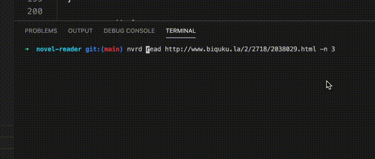
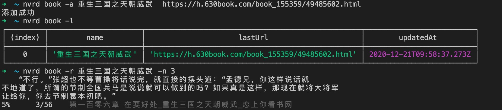
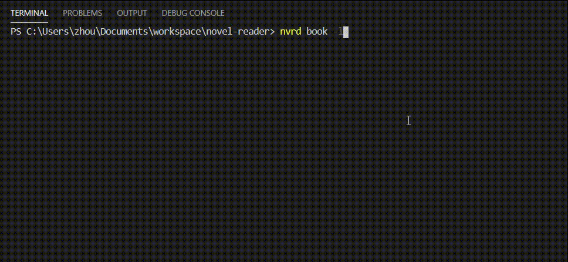

# Novel Reader

一款基于命令行跨平台文本小说阅读工具，996与10107程序员摸鱼划水必备神器。



> 添加书籍



> 实时更换书籍



## 功能亮点

* 使用nodejs开发
* 软件运行于命令行，对Vimer友好，支持Vim方式的Key Binding进行翻页和跳转。
* 支持Boss Key，方便紧急情况下对界面隐藏和伪装。

## 安装步骤

其实，你和摸鱼之间，只有两步的距离：

```bash
npm i -g @zt8989/novel-reader
# -n 3表示显示3行，默认为1
nvrd read <章节地址> -n 3

nvrd book -l # 列出所有书本
nvrd book -a <书名> <章节地址> #添加书本
nvrd book -s <书名> <章节地址> #修改书名地址
nvrd book --remove <书名> #删除书名
nvrd book -r [书名] -n 3 # 如果不填写书名或者查找不到会出现下拉列表, -n 3表示显示3行，默认为1

nvrd config -a <url> # 增加api地址用于同步
nvrd login # 登录
nvrd config -u # 上传阅读书籍列表和书源到服务器
nvrd config -d # 下载阅读书籍列表和书源到服务器
```

## 支持平台
* Mac OS
* Linux
* Windows

## 快捷键说明

* `ctrl+c` 退出程序
* `j`, `ctrl+n`, `<down>`显示下一行内容
* `k` 或者 `ctrl+p`, `<up>`显示上一行内容
* `b` Boss Key，隐藏当前内容并显示伪装Shell提示符
* `r` 重新获取当前页面
* `l` 展示书源列表
## 提示

* 只测试过笔趣阁相关网址，采集规则不一定适用其他网站

## 书源规则

[书源规则](./SOURCE.md)

## Issue 与 PR

欢迎提交issue与merge request。

## 协议

本开源软件基于[MIT](#)。